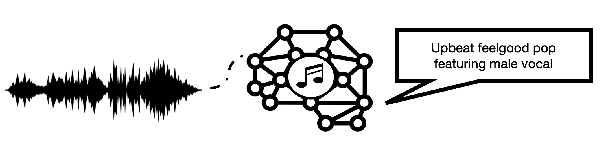

# MusCaps: Generating Captions for Music Audio
[Ilaria Manco](https://ilariamanco.com/)<sup>1</sup> <sup>2</sup>,
[Emmanouil Benetos](http://www.eecs.qmul.ac.uk/~emmanouilb/)<sup>1</sup>,
[Elio Quinton](https://scholar.google.com/citations?user=IaciybgAAAAJ)<sup>2</sup>,
[Gyorgy Fazekas](http://www.eecs.qmul.ac.uk/~gyorgyf/about.html)<sup>1</sup> <br>
<sup>1</sup>  Queen Mary University of London, <sup>2</sup>  Universal Music Group

<p align="center">

</p align="center">

This repository is the official implementation of ["MusCaps: Generating Captions for Music Audio"](https://arxiv.org/abs/2104.11984) (IJCNN 2021). In this work, we propose an encoder-decoder model to generate natural language descriptions of music audio. We provide code to train our model on any dataset of (audio, caption) pairs, together with code to evaluate the generated descriptions on a set of automatic metrics (BLEU, METEOR, ROUGE, CIDEr, SPICE, SPIDEr).

## Setup
The code was developed in Python 3.7 on Linux CentOS 7 and training was carried out on an RTX 2080 Ti GPU. Other GPUs and platforms have not been fully tested.

Clone the repo
```bash
git clone https://github.com/ilaria-manco/muscaps
cd muscaps
```

You'll need to have the `libsndfile` library installed. All other requirements, including the code package, can be installed with
```bash
pip install -r requirements.txt
pip install -e .
```

## Project structure

```
root
├─ configs                      # Config files
│   ├─ datasets
│   ├─ models  
│   └─ default.yaml              
├─ data                         # Folder to save data (input data, pretrained model weights, etc.)
│   ├─ audio_encoders   
│   ├─ datasets            
│   │   └─ dataset_name     
|   └── ...             
├─ muscaps
|   ├─ caption_evaluation_tools # Translation metrics eval on audio captioning 
│   ├─ datasets                 # Dataset classes
│   ├─ models                   # Model code
│   ├─ modules                  # Model components
│   ├─ scripts                  # Python scripts for training, evaluation etc.
│   ├─ trainers                 # Trainer classes
│   └─ utils                    # Utils
└─ save                         # Saved model checkpoints, logs, configs, predictions    
    └─ experiments
        ├── experiment_id1
        └── ...                  
```

## Dataset
The datasets used in our experiments is private and cannot be shared, but details on how to prepare an equivalent music captioning dataset are provided in the [data README](data/README.md).

## Pre-trained audio feature extractors
For the audio feature extraction component, MusCaps uses CNN-based audio tagging models like [musicnn](https://github.com/jordipons/musicnn). In our experiments, we use [@minzwon](https://github.com/minzwon)'s implementation and pre-trained models, which you can download from [the official repo](https://github.com/minzwon/sota-music-tagging-models/). For example, to obtain the weights for the [HCNN model](https://ieeexplore.ieee.org/abstract/document/9053669) trained on the [MagnaTagATune dataset](http://mirg.city.ac.uk/codeapps/the-magnatagatune-dataset), run the following commands

```bash
mkdir data/audio_encoders
cd data/audio_encoders/
wget https://github.com/minzwon/sota-music-tagging-models/raw/master/models/mtat/hcnn/best_model.pth
mv best_model.pth mtt_hcnn.pth
```

## Training
Dataset, model and training configurations are set in the respective `yaml` files in [`configs`](configs). Some of the fields can be overridden by arguments in the CLI (for more details on this, refer to the [training script](muscaps/scripts/train.py)).

To train the model with the default configs, simply run

```bash
cd muscaps/scripts/
python train.py <baseline/attention> --feature_extractor <musicnn/hcnn> --pretrained_model <msd/mtt>  --device_num <gpu_number>
```

This will generate an `experiment_id` and create a new folder in `save/experiments` where the output will be saved.

If you wish to resume training from a saved checkpoint, run

```bash
python train.py <baseline/attention> --experiment_id <experiment_id>  --device_num <gpu_number>
```

## Evaluation

To evaluate a model saved under `<experiment_id>` on the captioning task, run

```bash
cd muscaps/scripts/
python caption.py <experiment_id> --metrics True
```

## Cite

```bib
@inproceedings{manco2021muscaps,
    title={MusCaps: Generating Captions for Music Audio}, 
    author={Manco, Ilaria and Benetos, Emmanouil and Quinton, Elio and Fazekas, György},
    booktitle={2021 International Joint Conference on Neural Networks (IJCNN)}, 
    year={2021},
    pages={1-8},
    doi={10.1109/IJCNN52387.2021.9533461}
}
```

## Acknowledgements 
This repo reuses some code from the following repos: 
* [sota-music-tagging-models](https://github.com/minzwon/sota-music-tagging-models) by [@minzwon](https://github.com/minzwon)
* [caption-evaluation-tools](https://github.com/audio-captioning/caption-evaluation-tools) by [@audio-captioning](https://github.com/audio-captioning) 
* [mmf](https://github.com/facebookresearch/mmf) by [@facebookresearch](https://github.com/facebookresearch)
* [a-PyTorch-Tutorial-to-Image-Captioning](https://github.com/sgrvinod/a-PyTorch-Tutorial-to-Image-Captioning/) by [@sgrvinod](https://github.com/sgrvinod/)
* [allennlp](https://github.com/allenai/allennlp) by [@allenai](https://github.com/allenai/)

## Contact
If you have any questions, please get in touch: [i.manco@qmul.ac.uk](i.manco@qmul.ac.uk).
